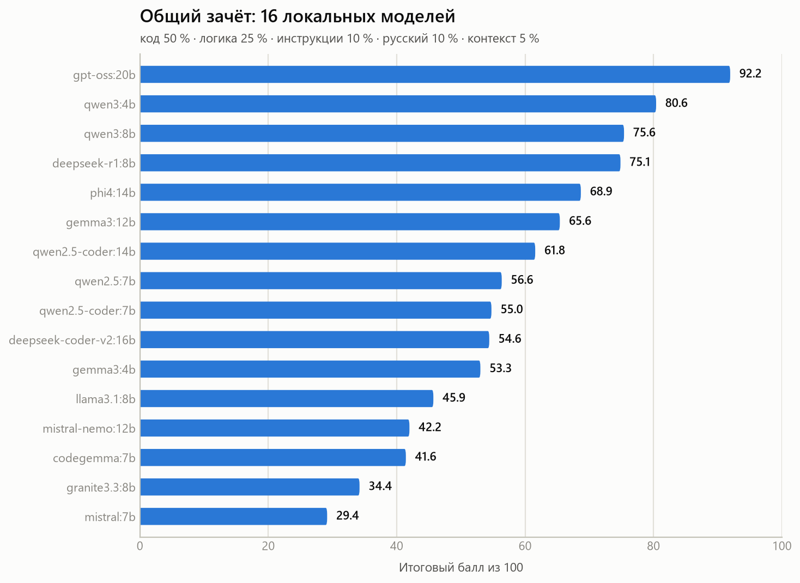
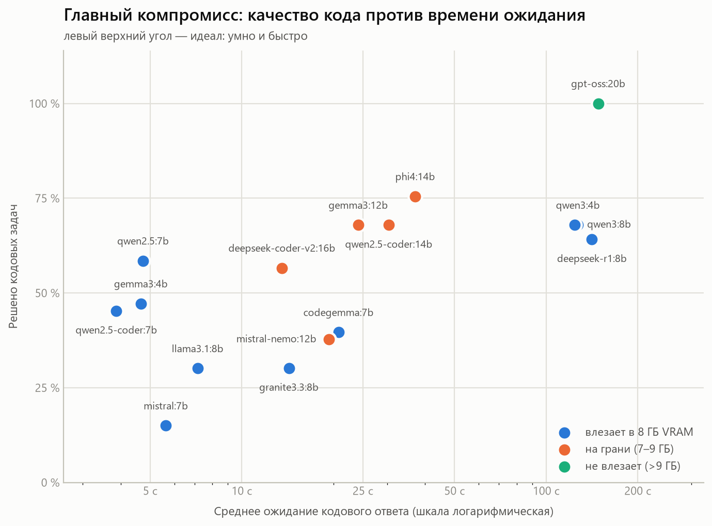
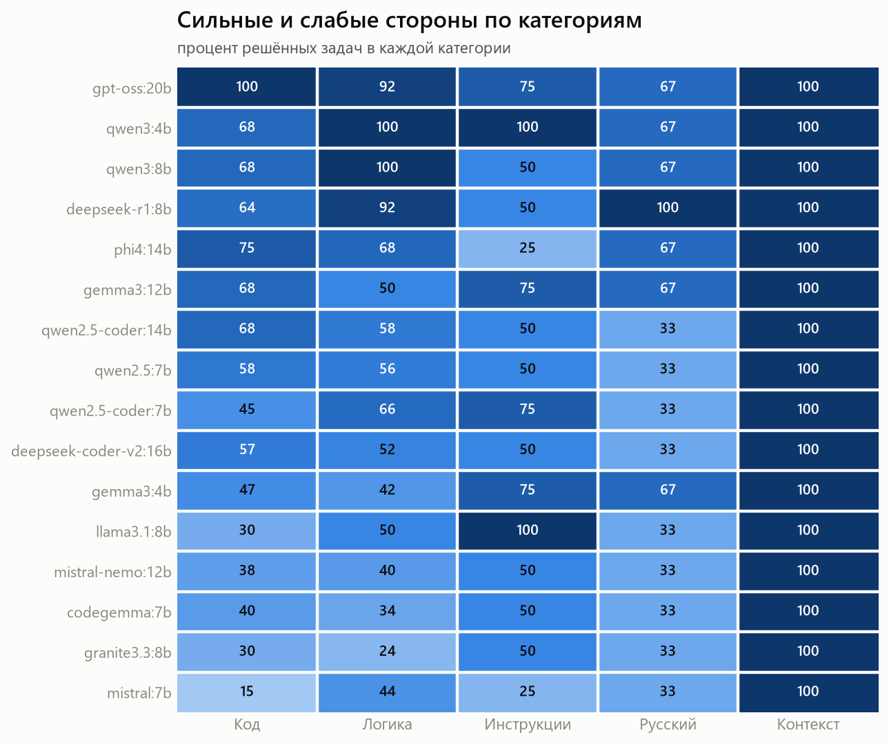
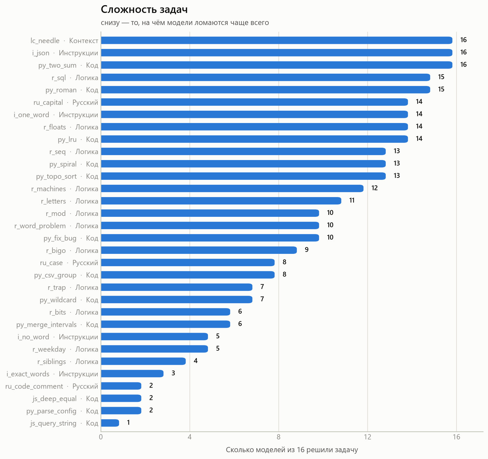
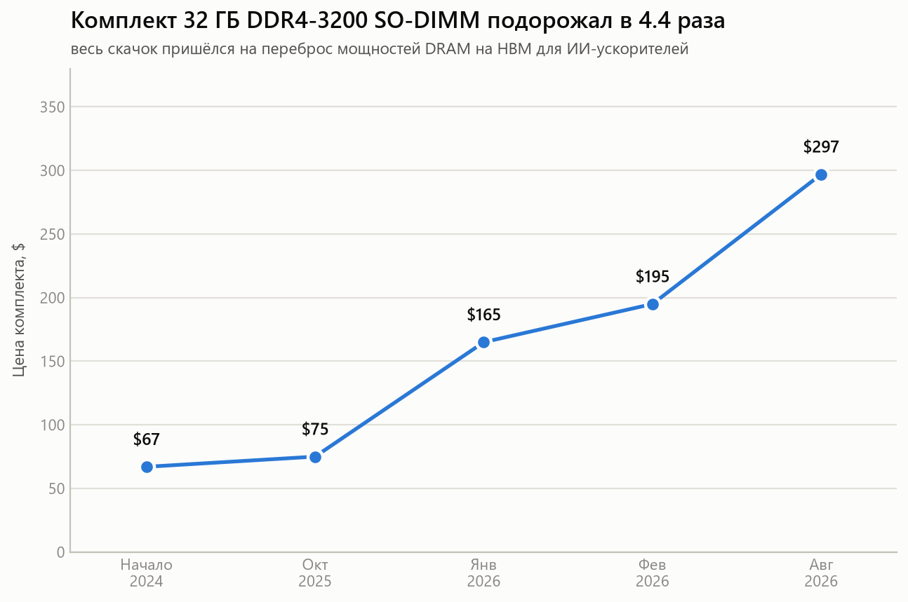
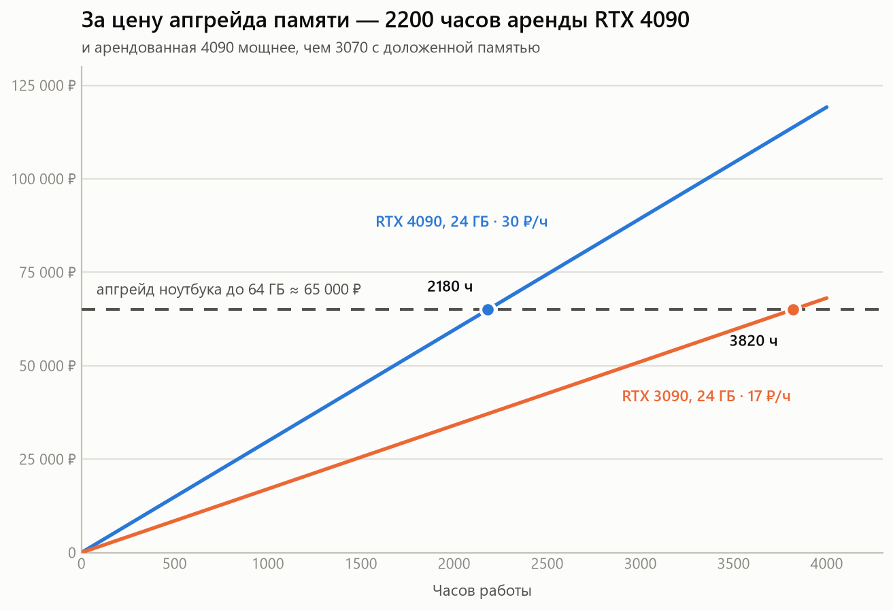

# Бенчмарк локальных LLM на игровом ноутбуке

Что реально может выдать локальная модель на **RTX 3070 Laptop с 8 ГБ видеопамяти** —
измерено, а не на глаз. **16 моделей**, по **32 задачи** на каждую, кодовые задачи
проверяются **исполнением unit-тестов**.

**Железо:** HP OMEN 15 · Ryzen 9 5900HX (8 ядер) · 16 ГБ RAM · RTX 3070 Laptop 8 ГБ VRAM
**Движок:** Ollama 0.21.2, кванты по умолчанию (Q4), `num_ctx = 8192`

---

## Коротко

| | Модель | Балл | Код | Ждать ответ |
|---|---|---|---|---|
| 🥇 | **gpt-oss:20b** | **92.2** | **100 %** | ~148 с |
| ⚡ | **gemma3:12b** — лучший баланс | 65.6 | 68 % | **~24 с** |
| 🏃 | **qwen2.5:7b** — если нужна мгновенность | 56.6 | 58 % | **~5 с** |

**gpt-oss:20b** — единственная модель, решившая все 13 кодовых задач. Но она весит
13.8 ГБ при 8 ГБ видеопамяти, поэтому **57 % слоёв считает процессор**: 6.7 tok/s и
две с половиной минуты ожидания. Годится для режима «спросил и пошёл заниматься
другим», а не для диалога.

Для повседневной работы практичнее **gemma3:12b**: столько же решённых кодовых задач,
сколько у qwen3:4b, qwen3:8b и qwen2.5-coder:14b, но ответ приходит **за 24 секунды
вместо двух минут**.

---

## Общий зачёт

<picture>
  <source media="(prefers-color-scheme: dark)" srcset="charts/ranking-dark.png">
  
</picture>

Балл = код 50 % + логика 25 % + следование инструкциям 10 % + русский 10 % +
длинный контекст 5 %.

---

## Главный вывод: tok/s обманывает

<picture>
  <source media="(prefers-color-scheme: dark)" srcset="charts/tradeoff-dark.png">
  
</picture>

**qwen3:4b выдаёт 69 tok/s — быстрее почти всех. И заставляет ждать 127 секунд.**
Потому что пишет по 6536 токенов рассуждений на одну кодовую задачу. gemma3:12b
вчетверо «медленнее» по токенам и вшестеро быстрее по факту — она укладывается
в 280 токенов.

Смотреть надо на время до готового ответа, а не на скорость генерации.

Второе, что видно на графике: **порог 8 ГБ видеопамяти — обрыв, а не плавный спад.**
Всё, что влезает в VRAM целиком, идёт на 40–75 tok/s. Всё, что не влезает, падает
до 6–13 tok/s.

---

## Сильные и слабые стороны

<picture>
  <source media="(prefers-color-scheme: dark)" srcset="charts/categories-dark.png">
  
</picture>

Профили заметно разные. qwen3 и deepseek-r1 почти безупречны в логике, но средние
в коде. phi4:14b наоборот — силён в коде, слабее в рассуждениях, и катастрофичен
в следовании формальным требованиям к ответу (25 %).

---

## Что за задачи

### Код — 13 задач, проверка исполнением

Ответ модели вставляется в файл, к нему дописываются assert'ы, запускается
`python` или `node`. Зачёт только при выходе с кодом 0. Никакой оценки «на глаз».

| Задача | Что проверяет |
|---|---|
| `py_two_sum` | хеш-поиск за O(n) |
| `py_merge_intervals` | слияние отрезков + запрет менять входной список |
| `py_roman` | две функции, круговой прогон 1..3999 |
| `py_wildcard` | шаблоны `*` и `?`, с проверкой на неэкспоненциальность |
| `py_topo_sort` | топологическая сортировка + обнаружение цикла |
| `py_lru` | LRU-кэш, 200 000 операций за 8 с (ловит не-O(1)) |
| `py_parse_config` | разбор INI: типы, кавычки, `=` внутри значения, пустые секции |
| `py_spiral` | обход матрицы по спирали, включая вырожденные случаи |
| `py_fix_bug` | **починить чужой сломанный бинарный поиск** (3 бага сразу) |
| `py_csv_group` | группировка с агрегацией, битые строки, сортировка при равных суммах |
| `js_deep_equal` | JS: NaN, `+0`/`−0`, Date, массив против объекта |
| `js_query_string` | JS: разбор query-строки, повторы ключей в массив, `+` как пробел |
| `ru_code_comment` | функция с **кириллическим именем** и русской докстрокой |

### Остальные 19

- **Логика (12):** счёт букв в «программировании», 9.11 против 9.9, день недели
  через 100 дней, «сколько сестёр у брата Марии», 7¹⁰⁰ mod 13,
  `(0b1011 << 2) ^ 0xF`, последовательность «посмотри и скажи», асимптотика
  вложенного цикла, ловушка про биту и мяч.
- **Следование инструкциям (4):** вернуть строго заданный JSON; ответить ровно
  пятью словами без пунктуации; одно слово заглавными; предложение о море
  **без единой буквы «а»**.
- **Русский (3):** падежи, факты, код с русской документацией.
- **Длинный контекст (1):** код доступа, спрятанный в 70 абзацах (~4800 токенов).

### Тесты проверены на себе

Перед запуском прогнаны **эталонные решения**: все 13 кодовых задач проходят,
а заведомо неверные заглушки падают. Иначе сломанный тест завалил бы все модели
незаслуженно. Проверка живёт в [`bench/validate_tasks.py`](bench/validate_tasks.py).

---

## Сложность задач

<picture>
  <source media="(prefers-color-scheme: dark)" srcset="charts/tasks-dark.png">
  
</picture>

`js_query_string` покорилась **ровно одной модели из 16**. Типичная ошибка —
разбить пару по всем знакам `=`, потеряв значение `x=y`, хотя в условии сказано
делить по первому. `py_parse_config` и `js_deep_equal` — по две модели.

Две задачи оказались слишком лёгкими и никого не различают: `lc_needle` и `i_json`
решили все 16. В следующей версии их надо усложнять.

---

## Полная таблица

| # | Модель | Размер | Балл | Код | Логика | Инстр. | Рус. | tok/s | Ждать ответ |
|---|--------|--------|------|-----|--------|--------|------|-------|-------------|
| 1 | `gpt-oss:20b` | 13.8 ГБ | **92.2** | 100 % | 92 % | 75 % | 67 % | 6.7 | 148 с |
| 2 | `qwen3:4b` | 2.5 ГБ | **80.6** | 68 % | 100 % | 100 % | 67 % | 69.0 | 127 с |
| 3 | `qwen3:8b` | 5.2 ГБ | **75.6** | 68 % | 100 % | 50 % | 67 % | 41.6 | 124 с |
| 4 | `deepseek-r1:8b` | 5.2 ГБ | **75.1** | 64 % | 92 % | 50 % | 100 % | 25.8 | 141 с |
| 5 | `phi4:14b` | 9.1 ГБ | **68.9** | 75 % | 68 % | 25 % | 67 % | 6.1 | 37 с |
| 6 | `gemma3:12b` | 8.1 ГБ | **65.6** | 68 % | 50 % | 75 % | 67 % | 13.4 | 24 с |
| 7 | `qwen2.5-coder:14b` | 9.0 ГБ | **61.8** | 68 % | 58 % | 50 % | 33 % | 7.4 | 30 с |
| 8 | `qwen2.5:7b` | 4.7 ГБ | **56.6** | 58 % | 56 % | 50 % | 33 % | 39.9 | 5 с |
| 9 | `qwen2.5-coder:7b` | 4.7 ГБ | **55.0** | 45 % | 66 % | 75 % | 33 % | 47.2 | 4 с |
| 10 | `deepseek-coder-v2:16b` | 8.9 ГБ | **54.6** | 57 % | 52 % | 50 % | 33 % | 21.8 | 14 с |
| 11 | `gemma3:4b` | 3.3 ГБ | **53.3** | 47 % | 42 % | 75 % | 67 % | 74.7 | 5 с |
| 12 | `llama3.1:8b` | 4.9 ГБ | **45.9** | 30 % | 50 % | 100 % | 33 % | 29.5 | 7 с |
| 13 | `mistral-nemo:12b` | 7.1 ГБ | **42.2** | 38 % | 40 % | 50 % | 33 % | 11.5 | 19 с |
| 14 | `codegemma:7b` | 5.0 ГБ | **41.6** | 40 % | 34 % | 50 % | 33 % | 10.9 | 21 с |
| 15 | `granite3.3:8b` | 4.9 ГБ | **34.4** | 30 % | 24 % | 50 % | 33 % | 19.2 | 14 с |
| 16 | `mistral:7b` | 4.4 ГБ | **29.4** | 15 % | 44 % | 25 % | 33 % | 44.4 | 6 с |

Разбор по каждой задаче — в [`results/REPORT.md`](results/REPORT.md).
Дословные ответы всех моделей — в `results/raw/`.

---

## Что ещё выяснилось

**Специализация «coder» не оправдалась.** Обычная `qwen2.5:7b` решила кодовых задач
больше (58 %), чем `qwen2.5-coder:7b` (45 %) — при одинаковом размере и архитектуре.

**Размер решает далеко не всё.** `qwen3:4b` на 2.5 ГБ обошла все модели на 7–16 ГБ,
кроме gpt-oss. А `gemma3:4b` (3.3 ГБ) обогнала `mistral:7b`, `codegemma:7b`
и `granite3.3:8b`.

**Две из трёх ошибок gpt-oss — языковые, а не фактические.** На русский вопрос
он ответил «Thursday» вместо «четверг» и «Canberra» вместо «Канберра». Ответы
верные, язык — нет.

**Рассуждения у qwen3 отключить не удалось.** Ни параметр `think: false`, ни суффикс
`/no_think` на Ollama 0.21.2 не меняют длину ответа — проверено, 1121 токен в обоих
режимах, до единицы. Стоит перепроверить на свежей версии Ollama.

---

## Перспектива, по которой мы не пошли: FreeToken

В августе 2026 берклиевская Sky Computing Lab — та же группа, что сделала vLLM —
выложила [FreeToken](https://github.com/FlashML-org/FreeToken): движок вывода,
построенный вокруг MoE-моделей на потребительском железе. Статья —
[arXiv:2608.16157](https://arxiv.org/abs/2608.16157) от 17.08.2026, лицензия
Apache 2.0.

Он бьёт ровно в главный вывод этого бенчмарка. **Наш обрыв на 8 ГБ — это то, что
FreeToken заявляет как решённое.** Пул экспертов MoE держится в системной RAM,
слои раскладываются между видеопамятью, процессором и памятью по фактической
пропускной способности, а не по принципу «влезло или не влезло». Заявка авторов —
Qwen3.6-35B-A3B на **39.3 tok/s** на ноутбучной RTX 4060 с 8 ГБ VRAM.

Мы это не запустили. Дальше — почему, потому что причина сама по себе результат.

### Пять условий, из которых у нас выполняются три

| | Наш ноут | Требуется |
|---|---|---|
| GPU | RTX 3070 Laptop, 8 ГБ, cc 8.6 | RTX 30/40/50 — **проходит** |
| Драйвер | 592.82, CUDA 13.1 | r580+ — **проходит** |
| CUDA toolkit | nvcc 11.1 | CUDA 13 с `nvcc` в PATH — ставится |
| ОС | Windows 11 | Linux x86_64; в `docs/install.md` Windows и WSL2 названы неподдерживаемыми |
| Системная RAM | **16 ГБ** | в эталонном замере — **32 ГиБ** |

Первые три решаемы. Четвёртое — обходится, хотя и против документации. Пятое не
решается ничем, кроме денег.

**Про 32 ГиБ пересказы новости умалчивают, а это ключевое число.** Весь смысл
метода в том, что эксперты лежат в системной памяти. Qwen3.6-35B-A3B в NVFP4 —
это ~18.6 ГБ только весов. У нас 8 ГБ VRAM плюс реально свободных ~11 ГБ RAM
после Windows, итого около 19 ГБ, где на KV-кэш и контекст не остаётся ничего.
Со стримингом с SSD модель запустится, но исчезнет ровно тот выигрыш, ради
которого всё затевалось.

### Что имело бы смысл померить

Одна модель из нашей таблицы попадает в окно точно: **`gpt-oss:20b`**. Она MoE
(21B всего, 3.6B активных), весит 13.8 ГБ, есть в списке поддерживаемых
FreeToken — и это наш победитель, задушенный ровно тем, что движок и лечит:
57 % слоёв на процессоре, 6.7 tok/s, 148 секунд ожидания.

Грубая оценка потолка: 3.6B активных параметров при ~0.5 байта на параметр —
это ~1.8 ГБ трафика на токен. Два канала DDR4-3200 дают ~51 ГБ/с теоретических
и 35–40 реальных, отсюда **15–30 tok/s**, то есть в 2–4 раза быстрее текущего.
Сходится с заявкой авторов про 2–4× против Ollama.

Это расчёт, а не замер. Пока не запущено — в таблицу цифра не идёт.

### Цена вопроса

Очевидный ход — доложить памяти. Оба слота заняты модулями по 8 ГБ, так что
апгрейд означает замену обоих на 2×32 ГБ. И тут выясняется, что момент худший
за десять лет.

<picture>
  <source media="(prefers-color-scheme: dark)" srcset="charts/ram-price-dark.png">
  
</picture>

Причина не в жадности розницы: Samsung, SK Hynix и Micron перебросили мощности
с потребительской DRAM на HBM для ИИ-ускорителей. Контрактные цены на DRAM
прибавили 90–95 % за один квартал, отдельные SKU DDR4 выросли более чем на
2200 % от минимумов 2024 года. Micron выпустил финальные EOL-уведомления по
DDR4; к концу 2026 мощности DDR4 ожидаются на уровне 20–25 % от 2024-го.

Комплект 2×32 ГБ SO-DIMM — это примерно $700, плюс российские 15–20 % за курс
и логистику: **около 65 000 ₽** по курсу ЦБ 85.13 ₽/$ на 20.08.2026. Сопоставимо
с остаточной стоимостью самого ноутбука.

Отдельная неприятность: DDR4 SO-DIMM — тупиковый формат. Переставить эти модули
будет некуда, продавать придётся в сжимающуюся базу. Покупка на пике умирающего
стандарта.

### Аренда против апгрейда

<picture>
  <source media="(prefers-color-scheme: dark)" srcset="charts/rent-vs-buy-dark.png">
  
</picture>

RTX 4090 на vast.ai и Runpod идёт по $0.29–0.50 в час, RTX 3090 — от $0.07.
По 30 ₽/ч за 4090 апгрейд окупается только после **2180 часов** — это три
месяца непрерывной работы.

Реалистичный бюджет на проверку FreeToken — часов 50–100, то есть
**1 500–3 000 ₽ против 65 000 ₽, в 20–40 раз дешевле**. Причём арендованная
машина ещё и мощнее: 4090 с 24 ГБ VRAM и 64–128 ГБ RAM против 3070 с 8 ГБ и
доложенной памятью. Апгрейд проигрывает и по деньгам, и по железу.

Покупка своего сервера — вариант средний. Серверная DDR4 ECC RDIMM идёт по
медиане $8.33/ГБ, так что 128 ГБ — это $550–1070, тоже не подарок. Зато у
серверных платформ 6–8 каналов памяти против наших двух: Xeon на DDR4-2666
в шести каналах даёт ~128 ГБ/с против ~51 ГБ/с у ноутбука, а для выгрузки
MoE-экспертов пропускная способность важнее объёма. Но это отдельный системник
и отдельные хлопоты.

### Решение

Память сейчас не покупаем — ждём либо снижения цен, либо другого способа
запускать большие модели. Для проверки самого FreeToken берём машину в аренду.

Но тут есть содержательная оговорка, важнее денежной. **Ценность этого
исследования в том, что все цифры сняты с реального игрового ноутбука с 8 ГБ,
а не из облака.** Замеры на арендованной 4090 не дополняют таблицу выше — они
отвечают на другой вопрос. Поэтому если FreeToken и будет померен, то двумя
отдельными строками: на этом ноутбуке в его нынешней конфигурации и на
арендованной машине как референс, с явной пометкой, что конфигурации разные.

Источники по ценам и требованиям — в [`docs/freetoken.md`](docs/freetoken.md).
Графики этого раздела рисует [`bench/charts_cost.py`](bench/charts_cost.py),
он не зависит от результатов бенчмарка.

---

## Честные оговорки

- **Меряются самодостаточные алгоритмические задачи**, а не работа с настоящим
  проектом: ни многофайловых правок, ни чтения чужой кодовой базы, ни вызова
  инструментов. Для оценки модели в роли агента, правящего репозиторий, этих
  цифр недостаточно.
- **Замеры скорости шумные.** Во время прогонов на ноутбуке работали посторонние
  приложения, занимавшие видеопамять и ядро процессора. Модели, целиком влезающие
  в VRAM, задеты слабо; у остальных реальная скорость на свободной машине будет выше.
- **«Думающим» моделям добавлен бюджет.** qwen3 и deepseek-r1 обрывались на лимите
  в 6144 токена; оборванные задачи перепрогнаны с лимитом 12288. Без этого их
  оценка по коду была занижена на 20–25 процентных пунктов. Модели без рассуждений
  в добавке не нуждались — они ни разу не упёрлись в лимит.
- **Один прогон на задачу**, temperature 0.2, seed 42. Доверительные интервалы
  не считались; разница в 2–3 балла между соседями по таблице ничего не значит.

---

## Как повторить

```bash
pip install matplotlib
ollama serve
```

```bash
python bench/validate_tasks.py          # проверить сами тесты
python bench/bench.py --all --resume    # прогнать все локальные модели
python bench/report.py                  # собрать таблицы
python bench/charts.py                  # отрисовать графики
python bench/charts_cost.py             # графики цен и аренды (Ollama не нужен)
```

Полезные переменные окружения: `BENCH_HTTP_TIMEOUT` (секунды на запрос, по
умолчанию 600), `BENCH_MAX_ERRORS` (сколько сбоев подряд до отбраковки модели),
`BENCH_THINK=0` (погасить рассуждения там, где движок это умеет).

---

## Структура

```
bench/
  tasks.py            32 задачи с тестами
  bench.py            прогон через Ollama API, замеры, оценка
  validate_tasks.py   проверка корректности самих тестов
  driver.py           очередь: подхватывает модели по мере скачивания
  retry_truncated.py  добор задач, оборванных лимитом токенов
  report.py           сборка таблиц
  charts.py           графики
  charts_cost.py      графики цен и аренды, без зависимости от результатов
results/
  REPORT.md           полные таблицы, включая разбор по каждой задаче
  *.json              сырые метрики по каждой модели
  raw/                дословные ответы моделей на каждую задачу
docs/
  freetoken.md        требования FreeToken, цены памяти и аренды, источники
charts/               графики, светлый и тёмный варианты
```

## Лицензия

MIT.
